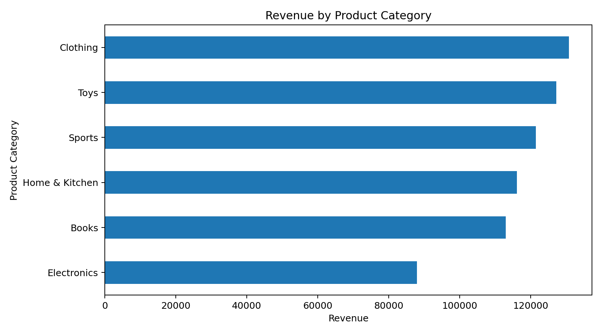
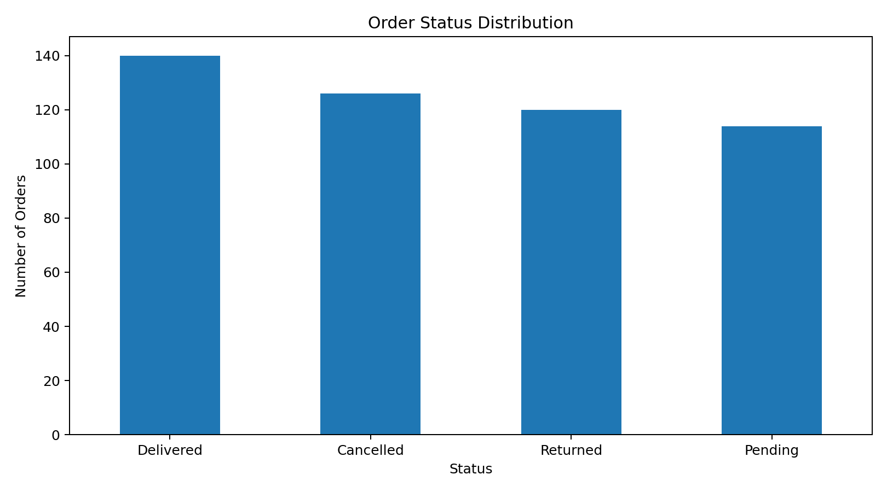
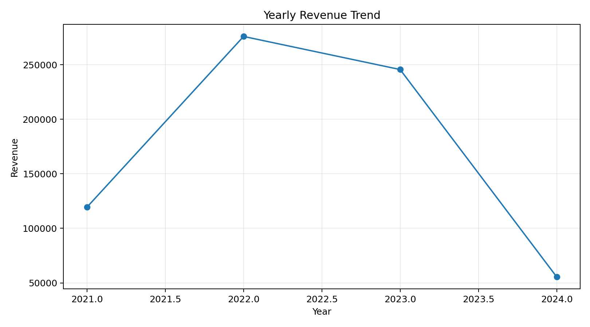
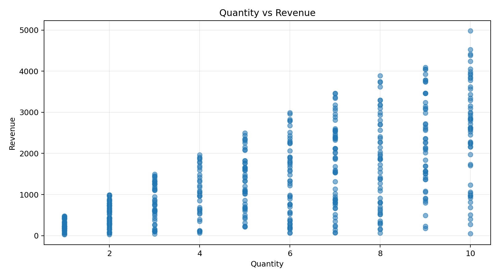

# Task 2 – Exploratory Data Analysis

## Project Overview

This project performs Exploratory Data Analysis (EDA) on a cleaned e-commerce orders dataset.

The dataset was cleaned during Task 1 by removing duplicate records, handling missing values, correcting data types, standardizing categorical values, and converting dates into a consistent format.

## Dataset

The cleaned dataset contains:

- 500 records
- 11 columns
- Customer information
- Product category
- Quantity
- Price
- Order date
- Signup date
- Order status

## Tools Used

- Python
- Pandas
- Matplotlib
- Excel
- GitHub

## Analysis Performed

The following analyses were performed:

1. Descriptive statistics
2. Product category analysis
3. Order status analysis
4. Country-wise analysis
5. Yearly revenue trend
6. Quantity and revenue relationship
7. Anomaly detection using the IQR method

## Revenue Calculation

Revenue was calculated using:

Revenue = Quantity × Price

## Important Statistics

- Total orders: 500
- Average quantity per order: 5.66
- Average product price: $248.07
- Average order revenue: $1,393.25
- Median order revenue: $1,068.92

## Key Insights

### 1. Clothing generated the highest revenue

Clothing generated approximately $130,780.21, making it the highest-revenue product category in the dataset.

### 2. Electronics generated the lowest revenue

Electronics generated approximately $87,974.17 and had the lowest number of orders among the product categories.

### 3. Delivered orders were not a majority

Delivered orders represented 28% of all orders. Cancelled, returned and pending orders together represented 72%.

### 4. 2022 had the highest yearly revenue

Revenue reached approximately $275,992.95 in 2022, which was the highest annual revenue in the available dataset.

### 5. Quantity and price both affect revenue

The analysis shows a positive relationship between quantity, price and calculated order revenue.

### 6. Anomalies were identified

The IQR method was used to identify unusually high or low revenue values. One unusually high-revenue order was identified for further investigation.

## Visualizations

### Revenue by Product Category

### Order Status Distribution

### Yearly Revenue Trend

### Quantity vs Revenue

## Conclusion

The exploratory analysis provides an overview of sales performance, product categories, order statuses and revenue trends. The findings can help identify high-performing categories, understand order outcomes and detect unusual transactions.

## Files

- `orders_cleaned.csv` – cleaned dataset
- `task2_analysis.py` – Python analysis script
- `Task_2_Exploratory_Analysis.xlsx` – Excel analysis
- PNG files – data visualization charts
